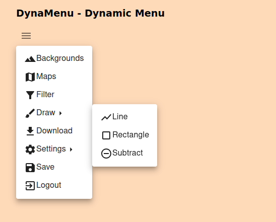

# DynaMenu

## Dynamic Menu for React


> Every UI needs a **Menu**



### Customize

#### Menu Structure

#### Flexible Icon Handling:

- For **SVG paths**: Provide the icon as a string, e.g., icon: `/assets/icons/my-icon.svg`.
- For **Material UI icons**: Pass the icon component like `Icons.Home` or any other MUI icon.

For list of all available icons in Material UI, refer to:

- [Material UI Icons](https://v5.mui.com/material-ui/material-icons/)

For SVG icons with creative commons license, for example:

- [Flaticon](https://www.flaticon.com/)
- [The Noun Project](https://thenounproject.com/icons/)
- [SVG Repo](https://www.svgrepo.com/)
- [IconScout](https://iconscout.com/free-icons)
- [FreePik](https://www.freepik.com/icons/creative-commons)
- [WikiMedia Commons: SVG icons](https://commons.wikimedia.org/wiki/Category:SVG_icons)

**Design Principle:** _One menu to control them all_

```
~Tatu Soininen~
  -=[ 2024 ]=-
```
